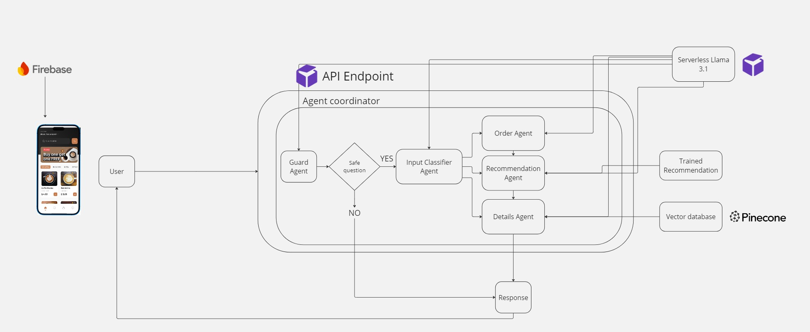

# Coffee Shop Customer Service Chatbot 🚀☕️

An AI-powered agent-based chatbot system designed to deliver customer service for coffee shop applications. This system integrates multiple specialized agents with LLM capabilities, RAG-enhanced knowledge retrieval, and recommendation engines to handle complex customer interactions across both React Native mobile and Telegram interfaces.

# 🎯 Project Overview
The goal of this project is to create a smart, **agent-based chatbot** that can:
* Handle real-time customer interactions with the chatbot including orders.
* Answer questions about menu items, including ingredients and allergens through a **Retreival augmented Generation (RAG) system**.
* Provide personalized product recommendations through a **market basket analysis recommendation engine**.
* Guide customers through a seamless order process, ensuring accurate and structured order details.
* Block irrelevant or harmful queries using a Guard Agent for safe and relevant interactions.


## 🧠 Chatbot Agent Architecture


The chatbot in this project is designed using a modular agent-based architecture, where each agent is responsible for a specific task, ensuring a seamless and efficient interaction between the user and the coffee shop’s services. This architecture enables the chatbot to perform complex actions by delegating tasks to specialized agents, making the system highly flexible, scalable, and easy to extend.

### 🤖 Key Agents in the System:
1. **Guard Agent:**
This agent acts as the first line of defense. It monitors all incoming user queries and ensures that only relevant and safe messages are processed by the other agents. It blocks inappropriate, harmful, or irrelevant queries, protecting the system and ensuring smooth conversations with users.
2. **Order Taking Agent:**
This agent is responsible for guiding customers through the order placement process. It uses chain-of-thought prompt engineering to simulate human-like reasoning, ensuring the order is accurately structured and all customer preferences are captured. It ensures that the chatbot gathers all necessary order details in a logical, step-by-step process, enhancing the reliability of the final order.
3. **Details Agent (RAG System):**
Powered by a Retrieval-Augmented Generation (RAG) system, the Details Agent answers specific customer questions about the coffee shop, including menu details, ingredients, allergens, and other frequently asked questions. It retrieves relevant data stored in the vector database and combines it with language generation capabilities to provide clear and precise responses.
4. **Recommendation Agent:**
This agent handles personalized product recommendations by working with the market basket recommendation engine. Triggered by the Order Taking Agent, it analyzes the user's current order or preferences and suggests complementary items. This agent aims to boost upselling opportunities or help users discover new products they might like.
5. **Classification Agent:**
This is the decision-making agent. It classifies incoming user queries and determines which agent is best suited to handle the task. By categorizing user intents, it ensures that queries are routed efficiently, whether the user is asking for recommendations, placing an order, or inquiring about specific menu details.

### ⚙️ How the Agents Work Together
The agents work collaboratively in a pipeline architecture to process user inputs:

1. A customer query is received and first assessed by the Guard Agent.
2. If valid, the Classification Agent determines the intent behind the user query (e.g., placing an order, asking about a product, or requesting a recommendation).
3. The query is then forwarded to the appropriate agent:
    * The Order Taking Agent handles order-related queries.
        * Order Agent can forward the order to the recommendation agent to try and upsell the user near the end of their order.
    * The Details Agent fetches specific menu information.
    * The Recommendation Agent suggests complementary products.


## 📱 Coffee Shop App


The React Native Coffee Shop App serves as the front-end interface for customers to interact with the AI-powered chatbot and explore the menu. Designed with a clean, intuitive user experience in mind, the app seamlessly integrates the chatbot for real-time customer service, enabling users to place orders, receive personalized product recommendations, and get detailed information about menu items.


## 💬 Telegram Bot Integration
The chatbot can also be accessed directly through Telegram, providing a lightweight and accessible interface for customers without requiring them to download a dedicated mobile app.

### Telegram Features:
* **Mini-RAG Interface:** Query the Retrieval-Augmented Generation system directly through Telegram chat.
* **Real-time Responses:** Get instant answers about coffee shop menu items, ingredients, and allergens using the vector database.
* **Order Management:** Place and track orders directly within Telegram.
* **Personalized Recommendations:** Receive product suggestions based on order history and preferences.
* **Accessibility:** Works on desktop, mobile, and web without additional installation.

### How Telegram Integration Works:
1. Users start a conversation with the coffee shop Telegram bot.
2. Queries are processed through the **Guard Agent** for safety validation.
3. The **Classification Agent** determines the user's intent.
4. Responses are generated using the Mini-RAG system (vector database + small LLM).
5. Relevant context is retrieved from the knowledge base and formatted for chat-friendly responses.

### Mini-RAG Components Used:
* **Document Chunking:** Menu items, policies, and FAQs are split into chunks.
* **Embedding Model:** Uses `snowflake-arctic-embed` or `all-MiniLM-L6-v2` for semantic search.
* **Vector Storage:** Embeddings stored in SQLite with `sqlite-vec` for efficient retrieval.
* **LLM Integration:** Small language models (via Ollama or Hugging Face) generate contextual responses.
* **Top-k Retrieval:** Returns the most relevant documents to supplement LLM responses.

# 📂 Directory Structure
```bash
├── coffee_shop_customer_service_chatbot
│     
│   ├── python_code
│       ├── API/               # Chatbot API for agent-based system
│       ├── dataset/           # Dataset for training recommendation engine    
│       ├── products/          # Product data (names, prices, descriptions, images)   
│       ├── build_vector_database.ipynb             # Builds vector database for RAG model   
│       ├── firebase_uploader.ipynb                 # Uploads products to Firebase    
│       ├── recommendation_engine_training.ipynb    # Trains recommendation engine 
```

## 🚀 System Components
Each component is independently deployable with configuration in its respective directory:
* **Backend (Python API):** Agent orchestration and LLM integration
* **Data Layer:** Vector database, recommendation engine, product information 

## ⚡ Running the Program
To start the chatbot backend and agent system, run:

```bash
python python/api/bot.py
```

This command initializes the bot with all configured agents and starts the server for handling customer interactions across both the mobile app and Telegram interfaces.

## 🔗 Refrence Links
* [RunPod](https://rebrand.ly/Runpod-Abdullah): RunPod Official Site - Infrastructure for deploying and scaling machine learning models.
* [Kaggle Dataset]([https://www.kaggle.com/datasets/ylchang/](https://www.kaggle.com/datasets/ylchang/coffee-shop-sample-data-1113)): Source of the dataset used for training the recommendation engine.

* [Hugging Face](https://huggingface.co/meta-llama/Llama-3.1-8B-Instruct): Hugging Face Models - Repository for Llama LLms, a state-of-the-art NLP model used in our chatbot.
* [Pinecone](https://docs.pinecone.io/guides/get-started/quickstart): Pinecone Documentation - Documentation for the vector database used in the project.
* [Firebase](https://firebase.google.com/docs): Firebase Documentation - Comprehensive guide for using Firebase to manage app data for the coffee shop app.
